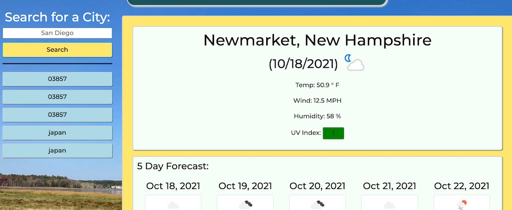

# 06-Homework-Weather-Planner
Week 6 Homework UNH Coding Bootcamp - Weather Planner

## Your Task

Create a dynamically populated Weather Dashboard app.  Allow user to input location that saves locally and provides current as well as 5 day weather forecast.  Allow user to click on historic searches and have them reload. 

## Criteria

    GIVEN a weather dashboard with form inputs
    WHEN I search for a city
    THEN I am presented with current and future conditions for that city and that city is added to the search history
    WHEN I view current weather conditions for that city
    THEN I am presented with the city name, the date, an icon representation of weather conditions, the temperature, the humidity, the wind speed, and the UV index
    WHEN I view the UV index
    THEN I am presented with a color that indicates whether the conditions are favorable, moderate, or severe
    WHEN I view future weather conditions for that city
    THEN I am presented with a 5-day forecast that displays the date, an icon representation of weather conditions, the temperature, the wind speed, and the humidity
    WHEN I click on a city in the search history
    THEN I am again presented with current and future conditions for that city

## Skills Used
    - Javascript
    - CSS
    - Bootstrap
    - MomentJS
    - LocalStorage
    - Server Side API
    - UI/UX design
## Final Product

https://tallen1985.github.io/06-Homework-Weather-Dashboard/